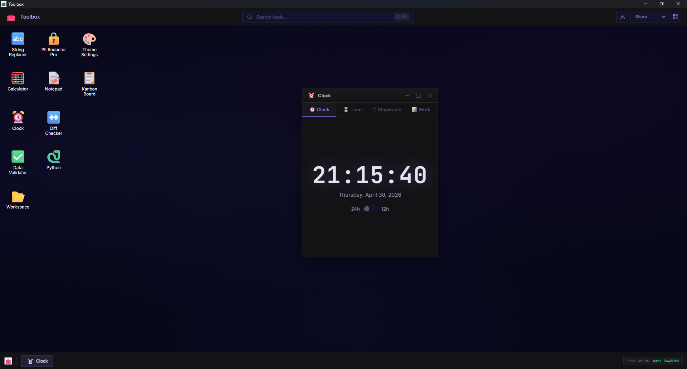
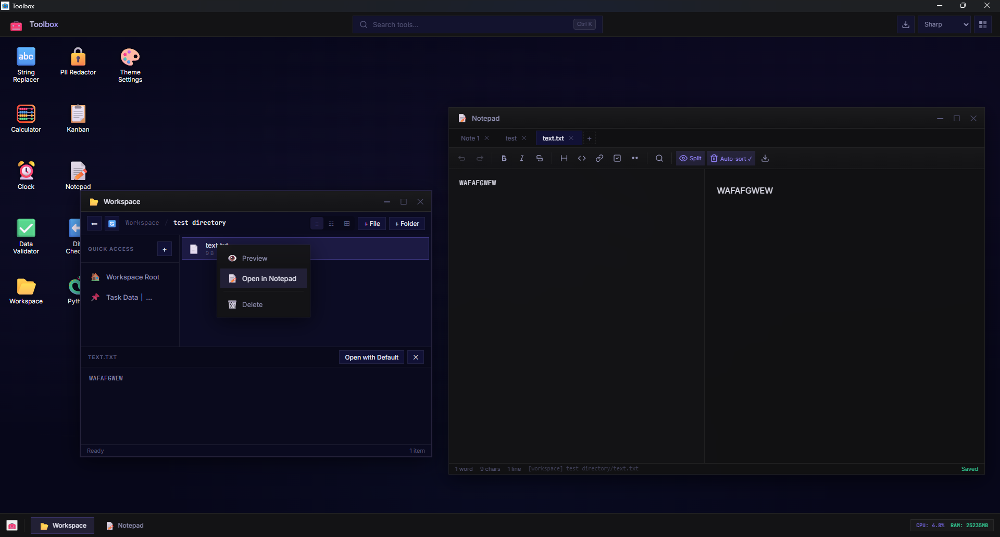
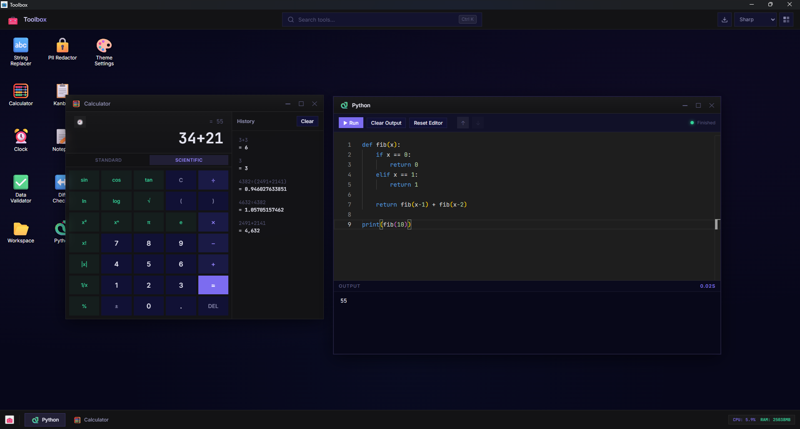

## Overview
This application is essentially a desktop emulator with a collection of tools that I need to use day-to-day for my work. 
It started off as an html webapp with a similar structure, but I have since ported it to a tauri application using Google Antigravity.
Because LLMs were used in the creation and porting of the app I decided to make it extremely modular. So one of the apps failing will generally not cause the whole application to crash.


_**Note**_

I have only tested the application and building it on Windows 11.

It works on my machine ¯\\\_(ツ)_/¯

* [Images](#images)
* [Current Tools](#current-tools)
* [Build Steps](#build-steps)
* [Testing](#testing)
* [Architecture](#architecture)
* [To do](#todo)

## Images




## Current Tools
* **Workspace Browser:** Simple file management inside a specified folder with the option to pin folders from local and network drives
* **Python Interpreter:** An interpreter that uses either a local python instance or a pyodide instance if one isn't found
* **Calculator:** Basic calculator with some scientific functions
* **Markdown Notepad:** Notepad with a preview panel to edit markdown, can be toggled to show preview only, editing view only, or side-by-side
* **Clock/Timer/Stopwatch:** Window with tabs for a Clock, Timer, Stopwatch, and Work tab
* **Various Data Tools:** Includes a Diff Checker (Monaco), Data Validator (CSV, JSON), and a PII Redactor
* **Kanban Board:** Basic Kanban board with draggable items customizable columns and space for multiple renamable boards.

## Build Steps
### 1. Prerequisites
* Install Node.js
* Install Rust
  
* System Tools
  * **Windows:** C++ Build Tools
  * **Linux:** webkit2gtk

### 2. Build
```
# 1. Install all dependencies 
# (This will automatically run 'sync-monaco' to populate the editor files)
npm install

# 2. Build the production binary
# This compiles the Rust backend and bundles the frontend into a single .exe (or .app/.deb)
npm run tauri build
```

## Testing
The project also includes a few Playwright tests to check basic app functionality.

* Run all tests: `npm test`
* View html report: `npx playwright show-report`

Any push to the repo also runs the tests via GitHub Actions.

## Architecture
* **Frontend:** Vanilla HTML, CSS, and JS
* **Backend:** Rust (Tauri), also handles some of the more intensive tool calls
* **Modularity:** Each tool is separated into its own JS file with the ability to run commands handled by the rust backend, for example, the python interpreter and the workspaces both use rust due to their complexity.
* **Libraries:** Makes use of both npm packages and Rust crates for frontend and backend tasks respectively.
  * **Examples:** Monaco editor for Python Interp. Various Rust crates for the Workspace browser


## TODO
Add exhaustive list of libraries
* Rust
* npm

Update readme as tools are added
